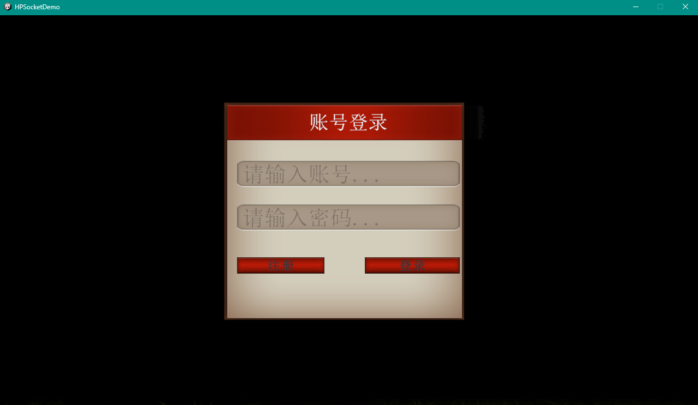
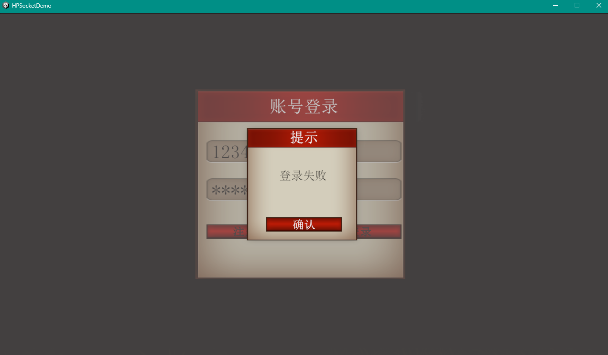
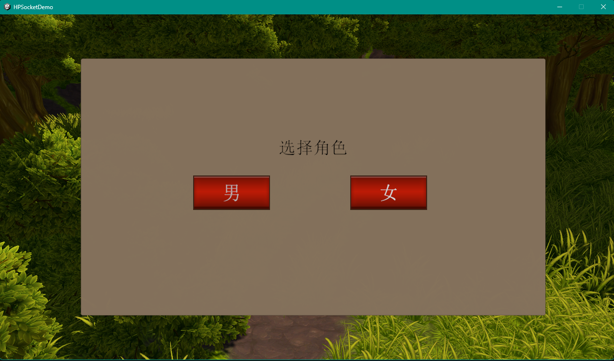
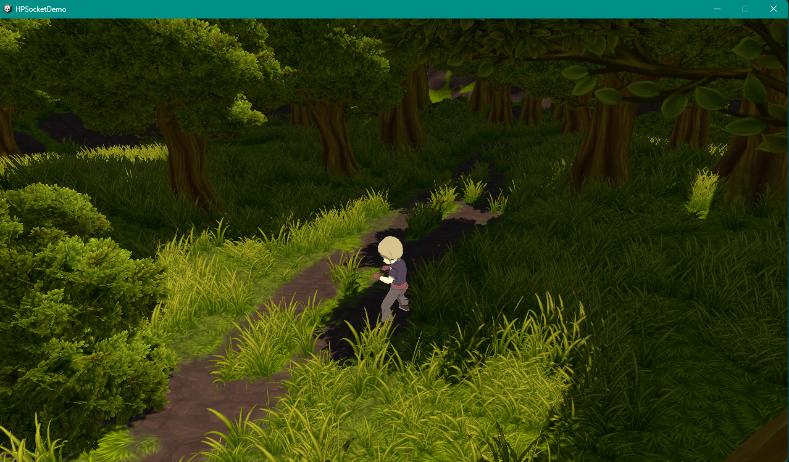
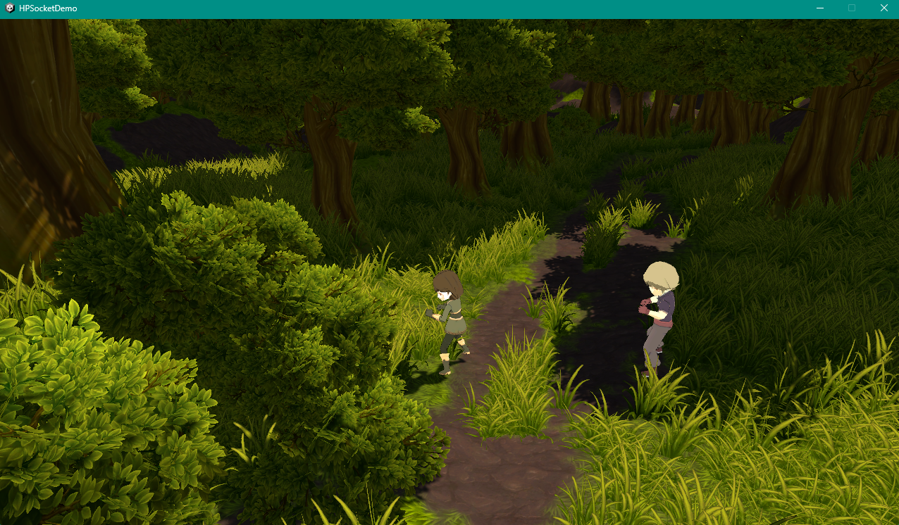
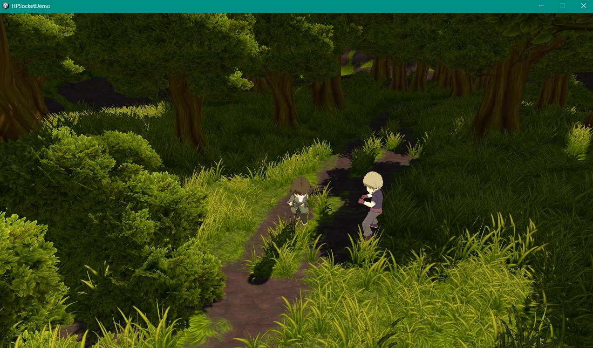
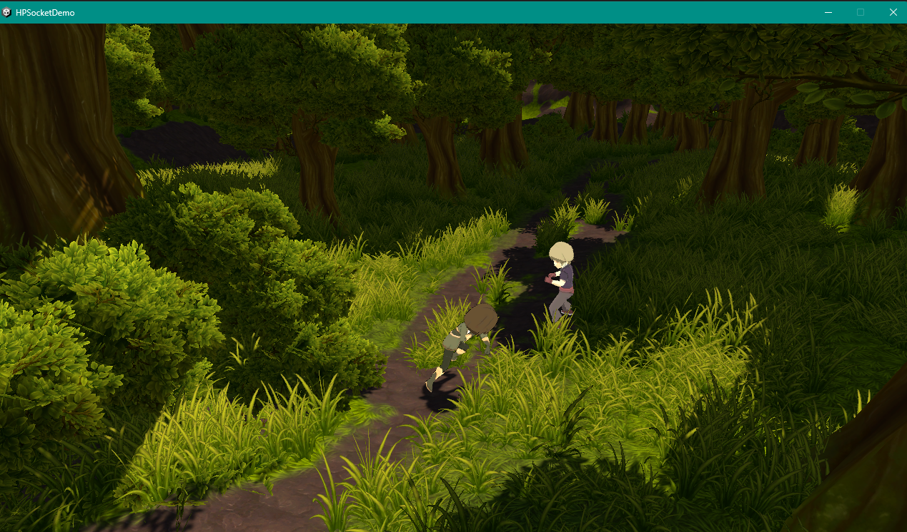
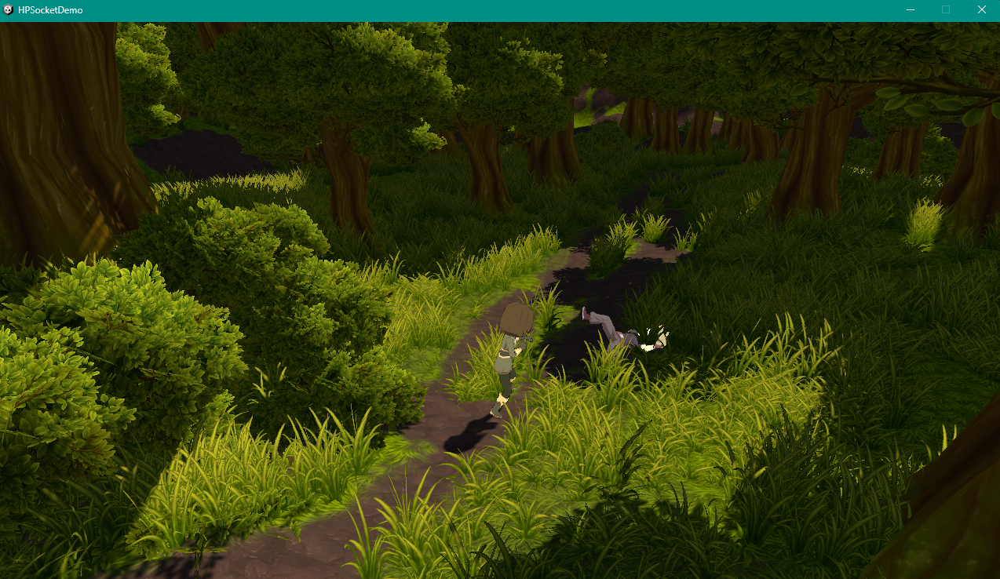
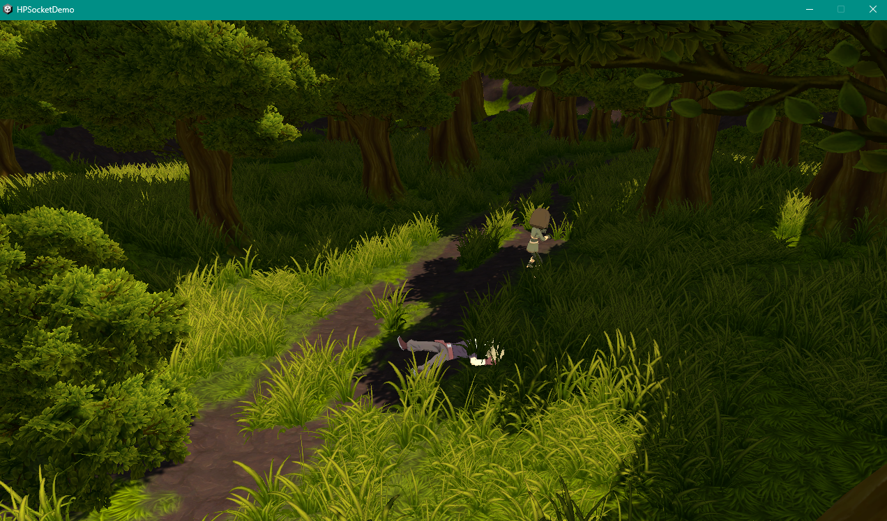

# myGameDemo
---
声明：本项目仅用于本人学习Unity游戏引擎，所做内容仅作为学习与成果展示，并不具有可玩性。

---
目前已实现功能：
- 基于HPSocket，实现客户端（HPSocketDemo）与服务端（HPSocketTest）网络搭建及通讯
- 基于Sqlite，将服务端与数据库进行连接并实现登录注册功能及在客户端实现相关UI组件和脚本
- 人物动态创建
- 多个客户端同步显示
- 基于NevMesh导航组件，实现人物移动
- 人物近身攻击
- 摄像头跟随人物

---
使用方式：
1. 下载并配置Sqlite。
2. 先启动HPSocketTest中的服务端(./HPSocketTest/Program.cs)。
3. 再启动HPSocketDemo中的客户端（./HPSocketDemo/game/HPSocketDemo.exe）。
4. 输入登录账号及密码。目前已经在数据库中的账号密码有：（可通过注册功能创建新的账号密码）
    账号|密码
    :-:|:-:
    1234|1234
    12345|12345
    123456|123456
5. 选择角色。
6. 鼠标右键点击地面移动，点击附近的敌人进行攻击。
7. 人物血量低于或等于0时死亡，不可再操作。
8. 关闭客户端后在其他客户端上该人物消失。

---
游戏截图：
- 登录：

- 选择人物：

- 多客户端端人物同步创建

- 镜头跟随人物移动：

- 人物攻击：

- 人物死亡：

---
更新日志：
2024.11.13
添加了Model文件夹，完善整体完整性。
客户端实现简单的对象池（生成飞刀），暂未与服务端对接。